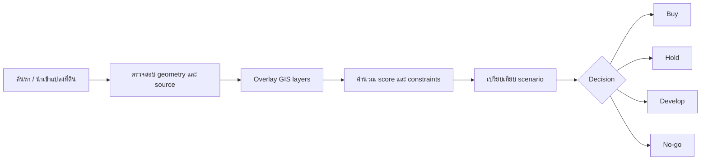

# 🗺️ Strategic Land Intelligence Platform

เอกสารชุดนี้เป็น blueprint ภาษาไทยสำหรับ Enterprise MVP ของ AP Thailand: แพลตฟอร์ม GIS-based Strategic Land Intelligence Platform เพื่อวิเคราะห์ คัดกรอง จัดอันดับ และสนับสนุนการตัดสินใจ `buy / hold / develop / no-go` สำหรับแปลงที่ดิน

> หมายเหตุ: เอกสารนี้อ้างอิง business brief ที่ได้รับและ source scaffold ปัจจุบัน ยังไม่ใช่เอกสารยืนยัน implementation จริงของ backend, API, หรือ production data pipeline

## 📚 ดัชนีเอกสาร

| ไฟล์ | กลุ่มผู้อ่านหลัก | เนื้อหา |
|---|---|---|
| [architecture.md](architecture.md) | Engineering, Data, Security, Executive | Clean Architecture, module boundaries, deployment overview, Mermaid component/context diagrams |
| [data-model.md](data-model.md) | Data, GIS, Engineering, Analytics | Entity model, PostGIS schema, data sources, ingestion strategy, Mermaid ERD |
| [product-roadmap.md](product-roadmap.md) | Product, Executive, Engineering, Data | Phased roadmap, backlog, milestones, AP Thailand decision workflow |
| [testing-evaluation.md](testing-evaluation.md) | QA, Product, Data, Engineering | QA strategy, evaluation rubric, acceptance criteria, test matrix |
| [project/current-state.md](project/current-state.md) | Executive, Product, Engineering | สถานะ prototype ปัจจุบัน สิ่งที่ทำแล้ว ข้อจำกัด และ verification |
| [project/implementation-inventory.md](project/implementation-inventory.md) | Engineering, QA, Product | Inventory ของ feature/source/test/docs ที่ implement แล้ว |
| [roadmap/development-phases.md](roadmap/development-phases.md) | Executive, Product, Engineering | Phase การพัฒนาต่อจาก prototype ถึง enterprise rollout |
| [delivery/master-backlog.md](delivery/master-backlog.md) | Product, Engineering, QA | Master backlog แยกตาม epic และ priority |
| [delivery/next-sprint-plan.md](delivery/next-sprint-plan.md) | Delivery Team | Sprint ถัดไปที่ควรเริ่มหลัง prototype |

## 🗂️ โครงสร้าง Docs ที่แนะนำ

```text
docs/
  README.md
  architecture.md
  data-model.md
  product-roadmap.md
  testing-evaluation.md
  project/
    current-state.md
    implementation-inventory.md
  roadmap/
    development-phases.md
  delivery/
    master-backlog.md
    next-sprint-plan.md
```

## 🎯 วัตถุประสงค์แพลตฟอร์ม

แพลตฟอร์มนี้ถูกออกแบบให้เป็นศูนย์กลางข้อมูลเชิงพื้นที่และเชิงกลยุทธ์สำหรับการตัดสินใจด้านที่ดิน โดยช่วยให้ทีม AP Thailand:

- รวมข้อมูล land bank, cadastre, zoning, transport, market, competitor, demand, risk และ POI ไว้ในมุมมองเดียว
- วิเคราะห์ suitability ของแปลงที่ดินด้วย scoring model ที่อธิบายเหตุผลได้
- ลดเวลาคัดกรองที่ดินจาก manual research เป็น workflow ที่ตรวจสอบย้อนกลับได้
- สนับสนุนการตัดสินใจระดับ investment committee ด้วย evidence, map layers, assumptions และ scenario comparison
- สร้าง governance สำหรับ source licensing, data lineage, update cadence และ confidence score

## 🧭 Core Decision Workflow



## 🧱 Core Layers

| Layer | ตัวอย่างข้อมูล | บทบาทในการตัดสินใจ |
|---|---|---|
| Internal Land Bank | แปลงที่ถือครอง, pipeline deal, asking price, owner status | ฐานข้อมูลการลงทุนและสถานะ deal |
| Parcels / Cadastre | ขอบเขตแปลง, parcel id, area, tenure | ระบุตำแหน่งและขนาดแปลง |
| Zoning / Planning | FAR, OSR, land use, restriction, future plan | ประเมิน buildability และ development envelope |
| Transportation | BTS/MRT, highway, arterial road, travel time | ประเมิน accessibility และ catchment |
| Competitor / Market | โครงการคู่แข่ง, price, absorption, launch timing | ประเมิน market gap และ positioning |
| Demographic / Demand | population, income, household, demand proxy | ประเมิน demand และ target segment |
| Risk | flood, easement, environmental, legal, access risk | ลด downside และ no-go factor |
| POI / Lifestyle | school, mall, hospital, park, office, retail | ประเมิน lifestyle fit และ neighborhood quality |

## 🧮 Strategic Land Score

คะแนนรวม 100 คะแนน แนะนำให้ทุกคะแนนมี `score`, `confidence`, `evidence`, และ `last_updated_at`

| Category | Weight | คำถามหลัก |
|---|---:|---|
| Location & Accessibility | 25 | เดินทางสะดวกและเข้าถึง demand node ได้ดีเพียงใด |
| Planning & Buildability | 20 | กฎหมายผังเมืองและข้อจำกัดรองรับ development potential หรือไม่ |
| Market Demand | 20 | มี demand ที่มีคุณภาพและสอดคล้องกับ product segment หรือไม่ |
| Competitive Position | 15 | แข่งขันได้หรือมีช่องว่างตลาดที่น่าสนใจหรือไม่ |
| Land Cost & Feasibility | 10 | ราคาที่ดินและ feasibility เบื้องต้นสมเหตุสมผลหรือไม่ |
| Risk & Constraint | 10 | มีความเสี่ยงที่กระทบ investment case มากเพียงใด |

## 🏢 Stakeholder View

| Stakeholder | สิ่งที่ต้องได้จากแพลตฟอร์ม |
|---|---|
| Executive / IC | ranked shortlist, decision memo, scenario comparison, key risks |
| Land Acquisition | parcel screening, owner/deal status, comparable land, due diligence checklist |
| Product Strategy | demand signal, competitor gap, pricing context, segment recommendation |
| Engineering | bounded contexts, API contracts, deployable architecture, observability requirements |
| Data / GIS | source registry, PostGIS model, ingestion pipeline, data quality checks |
| QA | acceptance criteria, scoring validation, map-layer test matrix, regression coverage |

## ⚖️ Governance และ Licensing Caution

แหล่งข้อมูล GIS และ market data ต้องถูกบันทึก source, license, refresh cadence, owner, และ permitted usage ก่อนนำไปใช้ใน production โดยเฉพาะ:

- `LandsMaps`: ตรวจสอบเงื่อนไขการใช้งาน, scraping/API policy, attribution และข้อจำกัด redistribution
- หน่วยงาน zoning/planning: ตรวจสอบ authoritative source, วันที่ประกาศใช้, version ของผังเมือง และเงื่อนไขเผยแพร่
- `GISTDA`: ตรวจสอบ license imagery/derived layer, resolution, redistribution และ commercial usage
- `OSM / Google Places`: OSM ต้องเคารพ ODbL attribution/share-alike; Google Places ต้องใช้ตาม Google Maps Platform terms และห้าม cache/แสดงผลนอกเงื่อนไข
- Market portals: ตรวจสอบสิทธิ์การใช้ข้อมูล listing, price, absorption proxy, scraping policy และ commercial redistribution

## 🚦 MVP Definition

MVP ที่ถือว่าใช้งานได้ควรมีอย่างน้อย:

- Interactive GIS map พร้อม layer toggle สำหรับ core layers สำคัญ
- Parcel profile page ที่รวม evidence, score, constraints และ source lineage
- Ranked shortlist ตาม score model 100 คะแนน
- Decision recommendation `buy / hold / develop / no-go` พร้อมเหตุผล
- Data source registry และ ingestion log
- QA test matrix สำหรับ scoring, geometry, map rendering และ data freshness
