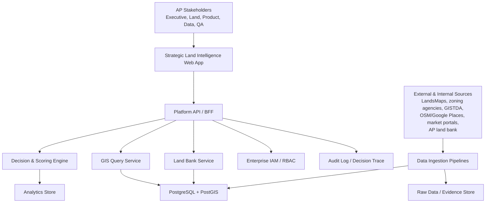
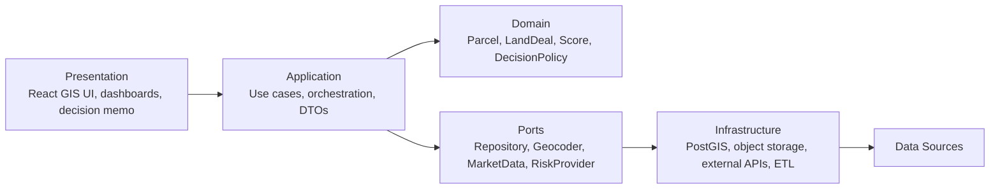
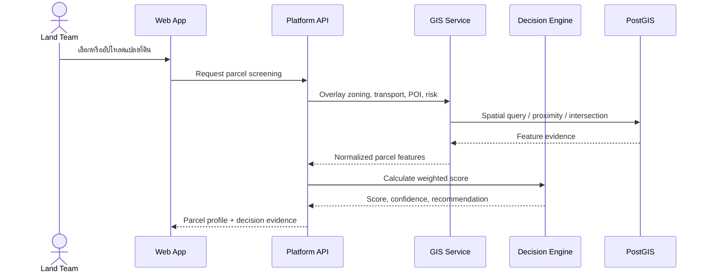
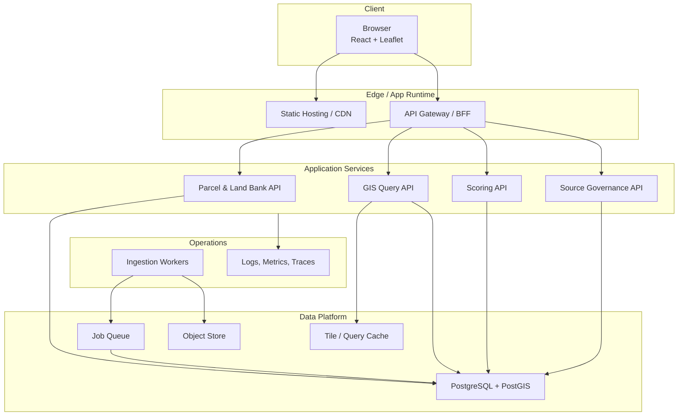

# 🏗️ Architecture Blueprint

เอกสารนี้อธิบาย target architecture สำหรับ Strategic Land Intelligence Platform ในรูปแบบ clean architecture โดยแยก business rules, data access, GIS services และ presentation layer ออกจากกัน เพื่อให้ MVP ขยายต่อเป็น enterprise platform ได้

> หมายเหตุ: source ปัจจุบันเป็น frontend scaffold ขนาดเล็ก จึงยังไม่สามารถยืนยัน backend service, API route, database หรือ infrastructure จริงได้ โครงสร้างด้านล่างเป็นสถาปัตยกรรมเป้าหมายที่ควรใช้เป็น baseline สำหรับ implementation

## 🎯 Architecture Goals

- รองรับการตัดสินใจ `buy / hold / develop / no-go` ด้วย evidence ที่ตรวจสอบย้อนกลับได้
- แยก domain logic ของ scoring และ decision engine ออกจาก UI และ external data sources
- ใช้ PostGIS เป็น spatial system of record สำหรับ geometry, overlay และ proximity analysis
- รองรับ ingestion จากหลาย source พร้อม lineage, licensing metadata และ quality checks
- Deploy ได้แบบ modular เพื่อแยก scaling ระหว่าง map UI, API, GIS processing และ batch ingestion

## 🧭 Context Diagram

## 🧱 Clean Architecture Layers

| Layer | Responsibility | ห้ามทำ |
|---|---|---|
| Presentation | แสดงแผนที่, filters, parcel profile, shortlist, decision memo | ห้ามฝัง scoring rules หรือ licensing logic |
| Application | จัด workflow เช่น screen parcel, calculate score, generate recommendation | ห้ามผูกติดกับ SQL/PostGIS implementation โดยตรง |
| Domain | business entities, score policy, decision rules, constraints | ห้ามเรียก external API หรือ database |
| Infrastructure | repository, PostGIS queries, ingestion adapters, file/object storage | ห้ามตัดสินใจเชิง business โดยไม่มี domain policy |

## 🧩 Module Boundaries

| Module | Ownership | Core Capability | Primary Data |
|---|---|---|---|
| Identity & Access | Platform | RBAC, role-based data access, audit identity | users, roles, permissions |
| Land Bank | Land Acquisition | AP internal land inventory, deal pipeline, owner/contact status | land parcels, deals, ownership notes |
| Parcel Registry | GIS/Data | parcel geometry, cadastre reference, normalized area | parcels, boundaries, source lineage |
| Planning & Zoning | GIS/Product | zoning overlay, FAR/OSR/buildability constraints | zoning polygons, planning rules |
| Transportation | Data/Product | station/road proximity, travel-time proxy, catchment | transport nodes, routes, isochrones |
| Market & Competitor | Product Strategy | competitor projects, pricing, absorption signal | projects, launches, market comps |
| Demand & Demographic | Data/Product | demand score, population/income/household proxy | demographic grids, demand indices |
| Risk & Constraint | Risk/Legal/GIS | flood, easement, legal, environmental, access risk | hazard layers, legal flags |
| POI & Lifestyle | Product Strategy | neighborhood amenities and lifestyle fit | POI, category taxonomy |
| Decision Engine | Product/Data | weighted score, recommendation, scenario comparison | feature store, scoring policy |
| Source Governance | Data Governance | source registry, license, lineage, freshness | source metadata, ingestion runs |

## 🔄 Core Use Cases

## 🛠️ Deployment Overview

## 🔐 Security และ Governance

- ใช้ RBAC แยกสิทธิ์ `Executive`, `Land Acquisition`, `Product Strategy`, `Data Admin`, `QA`, `Viewer`
- ทุก recommendation ต้องมี audit trail: model version, input layers, weights, source timestamps และ user action
- ข้อมูล owner/contact, deal notes และ feasibility assumptions ต้องจัดเป็น confidential
- External data ต้องมี source registry พร้อม license, permitted usage, refresh cadence และ retention rule
- Map export และ decision memo ต้องแสดง data freshness และ confidence เพื่อป้องกันการใช้ข้อมูลเก่าเกินจริง

## 📈 Observability

| Signal | Metric ที่ควรติดตาม |
|---|---|
| Data Freshness | ingestion success rate, source age, stale layer count |
| GIS Performance | map tile latency, spatial query p95, geometry error rate |
| Decision Engine | scoring latency, score drift, confidence distribution |
| Usage | parcel screenings/day, shortlist conversion, decision memo exports |
| Governance | license review status, source exceptions, audit log completeness |

