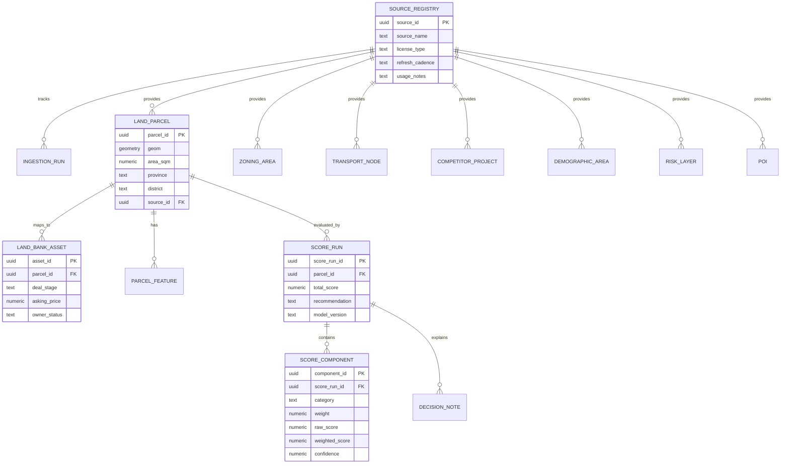

# 🧬 Data Model & GIS Schema

เอกสารนี้กำหนด target data model สำหรับ PostGIS-oriented Strategic Land Intelligence Platform โดยเน้น entity ที่จำเป็นต่อการ overlay, scoring, evidence traceability และ decision workflow

> หมายเหตุ: schema ด้านล่างเป็น proposed logical/physical baseline สำหรับ MVP ยังต้อง validate กับข้อมูลจริงของ AP Thailand, source licensing และ performance requirement ก่อน production migration

## 🗃️ Entity Overview

| Entity | Purpose | ตัวอย่าง Key Fields |
|---|---|---|
| `land_parcel` | แปลงที่ดินหลัก ใช้เป็น spatial anchor | parcel_id, geom, area_sqm, province, district, source_id |
| `land_bank_asset` | แปลงภายใน AP หรือ deal pipeline | asset_id, parcel_id, deal_stage, asking_price, owner_status |
| `zoning_area` | เขตผังเมืองและ planning rule | zone_code, far, osr, max_height, effective_date, geom |
| `transport_node` | สถานี รถไฟฟ้า ถนน จุดเชื่อมต่อ | node_type, line_name, status, opening_year, geom |
| `competitor_project` | โครงการคู่แข่งและ market comparable | brand, segment, launch_date, avg_price, units, geom |
| `demographic_area` | demand proxy ตามพื้นที่หรือ grid | population, income_index, household_count, demand_index, geom |
| `risk_layer` | flood/legal/environment/access constraint | risk_type, severity, confidence, geom |
| `poi` | lifestyle amenities และ neighborhood drivers | category, name, operator, confidence, geom |
| `score_run` | ผลคำนวณ score ของ parcel/scenario | total_score, recommendation, model_version, created_at |
| `source_registry` | governance ของแหล่งข้อมูล | source_name, license_type, owner, refresh_cadence, usage_notes |
| `ingestion_run` | log การ ingest และ quality validation | source_id, status, record_count, error_count, started_at |

## 🧭 Mermaid ERD

## 🧱 PostGIS-Oriented Schema

| Table | Geometry Type | Spatial Index | Notes |
|---|---|---|---|
| `land_parcel` | `MultiPolygon` | `GIST(geom)` | Normalize SRID เช่น EPSG:4326 หรือ local projected SRID สำหรับ distance |
| `zoning_area` | `MultiPolygon` | `GIST(geom)` | เก็บ version/effective date เพื่อรองรับผังเมืองหลายชุด |
| `transport_node` | `Point` | `GIST(geom)` | แยก status: existing, under_construction, planned |
| `transport_corridor` | `LineString` | `GIST(geom)` | ถนนหลัก รถไฟฟ้า เส้นทาง future infra |
| `competitor_project` | `Point` หรือ `Polygon` | `GIST(geom)` | มี market attributes และ confidence |
| `demographic_area` | `Polygon` หรือ `H3/Grid` | `GIST(geom)` | รองรับ aggregation ตาม catchment |
| `risk_layer` | `Polygon` หรือ `LineString` | `GIST(geom)` | severity และ source confidence สำคัญมาก |
| `poi` | `Point` | `GIST(geom)` | taxonomy ต้อง normalize ระหว่าง OSM/Google/third-party |
| `parcel_feature` | ไม่มี geometry | `(parcel_id, feature_key)` | materialized feature สำหรับ scoring |
| `score_run` | ไม่มี geometry | `(parcel_id, model_version)` | immutable result เพื่อ audit |

## 🧮 Scoring Feature Model

| Category | Weight | Feature Examples | Evidence |
|---|---:|---|---|
| Location & Accessibility | 25 | distance_to_mass_transit, arterial_access, commute_time_proxy | transport_node, corridor, isochrone |
| Planning & Buildability | 20 | zoning_fit, FAR, OSR, height_limit, land_shape_efficiency | zoning_area, parcel geometry |
| Market Demand | 20 | demand_index, income_index, household_growth, target_segment_fit | demographic_area, market signal |
| Competitive Position | 15 | competitor_density, price_gap, launch_supply, absorption_proxy | competitor_project, market portals |
| Land Cost & Feasibility | 10 | asking_price_per_wah, land_cost_ratio, preliminary_margin | land_bank_asset, feasibility assumption |
| Risk & Constraint | 10 | flood_severity, access_issue, legal_flag, easement_overlap | risk_layer, due diligence notes |

## 🔄 Ingestion Strategy

```mermaid
flowchart LR
    A["Source Registry"] --> B["Acquire / Upload"]
    B --> C["Raw Landing Zone"]
    C --> D["Schema Validation"]
    D --> E["Geometry Validation"]
    E --> F["Normalize CRS / Taxonomy"]
    F --> G["Load to Staging"]
    G --> H["Quality Checks"]
    H --> I["Publish to Core Tables"]
    I --> J["Materialize Parcel Features"]
    J --> K["Trigger Score Run"]
```

## 🧪 Data Quality Checks

| Check | Rule | Failure Handling |
|---|---|---|
| Geometry validity | `ST_IsValid(geom)` ต้องผ่าน | quarantine record และ log reason |
| SRID consistency | geometry ต้อง normalize เป็น SRID มาตรฐาน | transform หรือ reject ถ้าไม่ทราบ CRS |
| Duplicate detection | parcel/source key ซ้ำต้อง resolve | mark duplicate candidate |
| Spatial bounds | geometry ต้องอยู่ใน expected Thailand/admin bounds | reject หรือ manual review |
| Freshness | source age ไม่เกิน SLA | flag stale และลด confidence |
| License status | source ต้อง approved ก่อน publish | block production use |
| Confidence | derived data ต้องมี confidence score | default low confidence ถ้า evidence ไม่ครบ |

## ⚖️ Source Governance และ Licensing

| Source | Use Case | Caution |
|---|---|---|
| LandsMaps | parcel/cadastre lookup, land reference | ตรวจ ToS, attribution, redistribution, automation/scraping restrictions |
| Zoning agencies | planning/zoning rules | ต้องเก็บประกาศ/version/effective date และแยก authoritative vs interpreted layer |
| GISTDA | imagery, flood, satellite-derived layer | ตรวจ commercial usage, resolution, derived work และ redistribution |
| OSM | roads, POI, neighborhood context | ต้องทำ attribution และพิจารณา ODbL obligations |
| Google Places | POI/lifestyle signal | ใช้ตาม Google Maps Platform terms, cache/display restrictions และ billing policy |
| Market portals | competitor/listing/price signal | ห้าม assume scraping ได้ ต้องมี license หรือ data partnership |
| AP internal land bank | deal pipeline, owner notes, feasibility | confidential, ต้องมี RBAC และ audit trail |

## 🧾 Data Lineage Minimum

ทุก record ที่มาจาก external หรือ derived source ควรมี fields เหล่านี้:

- `source_id`
- `source_record_id`
- `ingestion_run_id`
- `observed_at`
- `published_at`
- `license_status`
- `confidence_score`
- `quality_status`
- `created_by` / `updated_by` สำหรับ manual override

