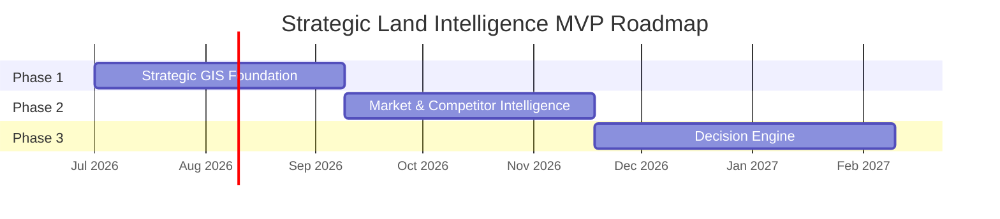

# 🛣️ Product Roadmap & Backlog

เอกสารนี้สรุป roadmap สำหรับ AP Thailand Strategic Land Intelligence Platform โดยจัดเป็น 3 phase ตาม business brief: Strategic GIS Foundation, Market & Competitor Intelligence, และ Decision Engine

## 🎯 Product North Star

ทำให้ AP Thailand สามารถเปลี่ยนการคัดกรองที่ดินจากงาน manual research ที่กระจัดกระจาย เป็น workflow เดียวที่มี GIS evidence, market context, scoring, governance และ decision recommendation ที่ตรวจสอบย้อนกลับได้

## 🧭 Phase Overview

## 🧱 Phase 1: Strategic GIS Foundation

เป้าหมาย: สร้างฐานข้อมูลแผนที่และ parcel screening workflow ที่เชื่อถือได้

| Workstream | Deliverables |
|---|---|
| GIS Map Foundation | interactive map, layer toggle, parcel selection, base map setup |
| Parcel Registry | normalized parcel table, geometry validation, source lineage |
| Internal Land Bank | land bank import, deal stage, owner/status notes, confidential access |
| Zoning & Planning | zoning overlay, FAR/OSR/buildability fields, planning evidence |
| Transportation | station/road layers, distance/proximity features |
| Governance | source registry, ingestion log, licensing review workflow |

### ✅ Phase 1 Exit Criteria

- User สามารถค้นหา/เลือกแปลงที่ดินและดู parcel profile ได้
- Map แสดง internal land bank, parcel, zoning และ transport layers ได้
- มี data lineage และ freshness ต่อ layer สำคัญ
- มี QA coverage สำหรับ geometry, layer rendering และ basic parcel screening

## 🏙️ Phase 2: Market & Competitor Intelligence

เป้าหมาย: เพิ่ม market context เพื่อดู demand, supply, competitor และ neighborhood quality

| Workstream | Deliverables |
|---|---|
| Competitor Intelligence | competitor project registry, price/segment fields, launch timing |
| Market Demand | demand index, demographic proxy, catchment analysis |
| POI & Lifestyle | POI taxonomy, amenity density, lifestyle fit features |
| Market Portal Governance | license review, permitted fields, refresh cadence |
| Comparative Views | parcel-vs-competitor map, market gap summary, shortlist filters |

### ✅ Phase 2 Exit Criteria

- Parcel profile มี competitor, demand และ POI evidence
- Product team เห็น market gap และ segment fit เบื้องต้น
- External market sources มี license/governance status ชัดเจน
- มี validation test สำหรับ demand/competitor feature calculation

## 🧠 Phase 3: Decision Engine

เป้าหมาย: สร้าง scoring model, scenario comparison และ recommendation workflow สำหรับ investment decision

| Workstream | Deliverables |
|---|---|
| Weighted Score Model | 100-point score with category weights and confidence |
| Scenario Analysis | product scenario, price assumption, risk adjustment |
| Recommendation | buy / hold / develop / no-go with evidence |
| Decision Memo | exportable summary for IC, assumptions, source timestamps |
| Model Governance | model versioning, score audit trail, override reason |

### ✅ Phase 3 Exit Criteria

- ระบบจัดอันดับแปลงตาม weighted score ได้
- Recommendation มี evidence และ confidence ไม่ใช่ black-box output
- ผู้ใช้ export decision memo ได้
- QA ทดสอบ score consistency, threshold และ audit trail ได้ครบ

## 🧮 Scoring Backlog

| Category | Weight | MVP Feature | Later Enhancement |
|---|---:|---|---|
| Location & Accessibility | 25 | distance to station/arterial road | travel-time isochrone, multimodal access |
| Planning & Buildability | 20 | zoning/FAR/OSR overlay | automated massing envelope, legal interpretation workflow |
| Market Demand | 20 | demand index by catchment | household segmentation, lead/search demand signal |
| Competitive Position | 15 | competitor density and price proxy | absorption model, launch timing simulation |
| Land Cost & Feasibility | 10 | asking price benchmark | feasibility model, margin sensitivity |
| Risk & Constraint | 10 | flood/legal/access flags | probabilistic risk adjustment, mitigation cost |

## 📌 Prioritized Backlog

| Priority | Epic | User Story |
|---|---|---|
| P0 | Parcel Screening | ในฐานะ Land team ฉันต้องเลือกแปลงบนแผนที่และเห็น profile เบื้องต้น เพื่อคัดกรองดีลได้เร็ว |
| P0 | Source Governance | ในฐานะ Data admin ฉันต้องเห็น license/freshness ของแต่ละ layer เพื่อป้องกันการใช้ข้อมูลผิดเงื่อนไข |
| P0 | Zoning Overlay | ในฐานะ Product strategy ฉันต้องรู้ข้อจำกัดผังเมือง เพื่อประเมิน buildability ได้ |
| P1 | Competitor Map | ในฐานะ Product team ฉันต้องเห็นโครงการคู่แข่งรอบแปลง เพื่อประเมิน positioning |
| P1 | Demand Signal | ในฐานะ Executive ฉันต้องเห็น demand proxy เพื่อเทียบแปลงหลายพื้นที่ |
| P1 | POI/Lifestyle Fit | ในฐานะ Product team ฉันต้องเห็น amenity context เพื่อแนะนำ product segment |
| P2 | Weighted Scoring | ในฐานะ Investment committee ฉันต้องเห็น score พร้อมเหตุผล เพื่อจัดอันดับ shortlist |
| P2 | Decision Memo | ในฐานะ Executive ฉันต้อง export memo ที่มี evidence และ assumptions เพื่อประชุมตัดสินใจ |
| P2 | Scenario Comparison | ในฐานะ Strategy team ฉันต้องเปรียบเทียบ develop scenario เพื่อเลือก investment path |

## 🧑‍💼 Operating Model

| Role | Responsibility |
|---|---|
| Product Owner | define decision workflow, score interpretation, roadmap priority |
| GIS/Data Lead | manage source registry, ingestion, spatial quality, lineage |
| Engineering Lead | API, PostGIS performance, auth, deployment, observability |
| Land Acquisition Lead | validate parcel/deal workflow and due diligence fields |
| Product Strategy Lead | validate market, competitor, demand and POI interpretation |
| QA Lead | own acceptance criteria, scoring regression and map-layer validation |
| Executive Sponsor | approve scoring policy, governance exceptions and rollout gates |

## ⚠️ Key Risks

| Risk | Mitigation |
|---|---|
| External source licensing ไม่ชัดเจน | ทำ source registry และ legal review ก่อน publish |
| Parcel geometry ไม่ตรงกับ authoritative source | เก็บ confidence/source date และ manual review queue |
| Scoring ถูกใช้เป็น black-box decision | แสดง component score, evidence, model version และ override reason |
| Market data stale หรือ biased | ระบุ freshness, confidence และ source limitations ในทุก decision memo |
| GIS query ช้าเมื่อข้อมูลโต | ใช้ spatial index, materialized features, tile/query cache |

