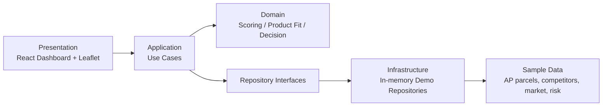
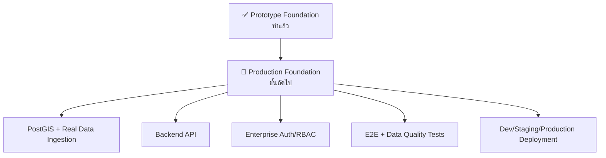

# ✅ สถานะปัจจุบันของ Prototype

เอกสารนี้สรุปว่า **Strategic Land Intelligence Platform** ทำอะไรเสร็จแล้วในเวอร์ชัน prototype ปัจจุบัน และอะไรที่ยังเป็นข้อจำกัดก่อนเข้าสู่ production สำหรับ AP Thailand

## 🎯 สรุประดับผู้บริหาร

ตอนนี้ระบบเป็น **working prototype** สำหรับสาธิตแนวคิดของ Strategic Land Intelligence Platform แล้ว โดยมี dashboard, map view, parcel portfolio, scoring logic, product fit, decision recommendation และเอกสาร architecture ภาษาไทย

ระบบยังไม่ใช่ production เพราะข้อมูลยังเป็น sample data ใน memory และยังไม่เชื่อมต่อ PostGIS, API backend, authentication หรือ data ingestion pipeline จริง

## 🧩 สิ่งที่ทำแล้ว

| หมวด | สถานะ | รายละเอียด |
|---|---|---|
| Frontend App | ✅ ทำแล้ว | React + Vite dashboard สำหรับดูแปลงที่ดิน, แผนที่, portfolio, inspector panel |
| Map Experience | ✅ ทำแล้ว | ใช้ Leaflet/React Leaflet แสดง polygon แปลงที่ดินและ marker คู่แข่ง |
| Domain Model | ✅ ทำแล้ว | มี types สำหรับ parcel, GIS layer, competitor, market signal, risk signal, score, product fit, decision |
| Clean Architecture | ✅ ทำแล้ว | แยก `domain`, `application`, `infrastructure`, `presentation` |
| Scoring Engine | ✅ ทำแล้ว | Land Potential Score 100 คะแนน พร้อม weight ตาม business brief |
| Product Fit | ✅ ทำแล้ว | แนะนำ product เช่น condominium, townhome, detached house, mixed-use |
| Decision Engine | ✅ ทำแล้ว | แนะนำ `buy / hold / develop / no-go` พร้อมเหตุผลและ next actions |
| Demo Repository | ✅ ทำแล้ว | In-memory repositories สำหรับ parcel, competitor, market, risk, GIS layer |
| Tests | ✅ ทำแล้ว | Unit tests สำหรับ scoring, recommendation และ repository |
| Thai Docs | ✅ ทำแล้ว | มี architecture, data model, roadmap, testing/evaluation docs |
| GitHub Repo | ✅ ทำแล้ว | Public repo ถูกสร้างและ push prototype version แล้ว |

## 🏗️ โครงสร้างระบบที่มีตอนนี้

## 📂 โครงสร้าง source สำคัญ

| Path | บทบาท |
|---|---|
| `src/domain/` | Business rules, scoring model, decision recommendation |
| `src/application/` | Use cases เช่น evaluate parcel, list opportunities |
| `src/infrastructure/` | In-memory repository และ sample data |
| `src/presentation/` | Dashboard UI และ presentation mapper |
| `src/test/` | Unit tests และ test builders |
| `docs/` | เอกสารภาษาไทยสำหรับ architecture, roadmap, data model, testing |

## 🧪 Verification ล่าสุด

| Command | สถานะ | หมายเหตุ |
|---|---|---|
| `npm run build` | ✅ ผ่าน | TypeScript + production build ผ่าน |
| `npm run test` | ✅ ผ่าน | 13 tests ผ่าน |
| `npm audit --omit=dev` | ✅ ผ่าน | 0 vulnerabilities |

## ⚠️ ข้อจำกัดปัจจุบัน

- ยังไม่มี backend API จริง
- ยังไม่มี PostgreSQL/PostGIS
- ยังไม่มี upload/import SHP, KML, GeoJSON, CSV
- ยังไม่มี authentication และ RBAC
- ยังไม่มี source registry UI
- ยังไม่มี data ingestion log จริง
- ยังไม่มี report export / investment memo
- ยังไม่มี production deployment pipeline
- ยังไม่ได้เชื่อมข้อมูลจริงจาก LandsMaps, BMA zoning, GISTDA, OSM, market portal หรือ internal AP systems

## 🚦 สถานะโดยรวม

