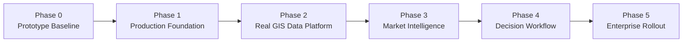
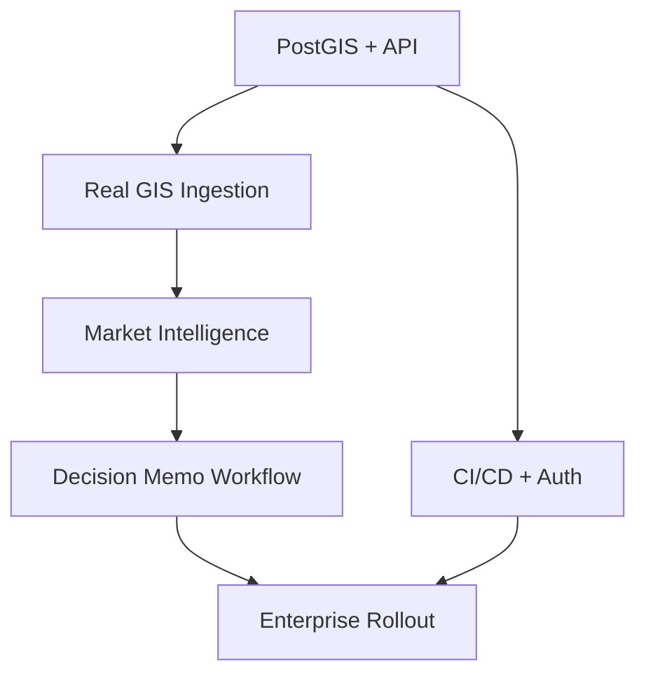

# 🧭 Development Phases

เอกสารนี้อธิบาย phase การพัฒนาต่อจาก prototype จนถึง production rollout สำหรับ AP Thailand Strategic Land Intelligence Platform

## 🗺️ Phase Map

## ✅ Phase 0: Prototype Baseline

**สถานะ:** ทำแล้ว

เป้าหมายของ phase นี้คือพิสูจน์ concept, UX direction, clean architecture และ scoring workflow

### Deliverables

- React dashboard
- Leaflet map prototype
- In-memory sample data
- Domain scoring engine
- Product fit recommendation
- Decision recommendation
- Thai documentation
- Unit tests
- Public GitHub repo

### Exit Criteria

- `npm run build` ผ่าน
- `npm run test` ผ่าน
- Demo เปิดดูได้ใน browser
- ผู้บริหาร/ทีม product เข้าใจว่า platform จะช่วยตัดสินใจที่ดินอย่างไร

## 🏗️ Phase 1: Production Foundation

**สถานะ:** ขั้นถัดไปที่ควรเริ่มทันที

เป้าหมายคือเปลี่ยน prototype จาก in-memory app ให้มี foundation ที่พร้อมต่อข้อมูลจริงและ deploy ได้

### Workstreams

| Workstream | งานที่ต้องทำ |
|---|---|
| Backend API | สร้าง API service สำหรับ parcel, scoring, layer, source registry |
| Database | ตั้ง PostgreSQL + PostGIS พร้อม migration |
| Auth | วาง login และ RBAC เบื้องต้น |
| Repository Adapter | เปลี่ยนจาก in-memory เป็น PostGIS repository |
| CI/CD | เพิ่ม GitHub Actions สำหรับ build/test |
| Environment | แยก local/dev/staging config |

### Exit Criteria

- ระบบอ่าน/เขียน parcel จาก PostGIS ได้
- API มี contract ชัดเจน
- มี migration scripts
- มี authentication ขั้นต้น
- CI รัน test/build ทุก push
- demo ยังใช้งานได้หลังเปลี่ยน data source

## 🗄️ Phase 2: Real GIS Data Platform

**สถานะ:** ทำหลัง Phase 1

เป้าหมายคือทำ data ingestion และ GIS layer จริง เพื่อให้ platform ไม่ใช่ mock data

### Workstreams

| Workstream | งานที่ต้องทำ |
|---|---|
| Land Bank Import | Import AP land bank จาก Excel/CSV |
| Shape Upload | รองรับ SHP, GeoJSON, KML/KMZ, CSV lat-lon |
| Zoning Layer | Import zoning/FAR/OSR layer |
| Flood Layer | Import GISTDA/flood recurrence layer |
| Transport Layer | Import BTS/MRT/road/expressway layer |
| Source Registry | เก็บ source, license, owner, refresh cadence, confidence |
| Data Quality | Geometry validation, CRS validation, duplicate check |

### Exit Criteria

- มี ingestion log ทุกครั้ง
- ข้อมูลทุก layer มี source lineage
- Map แสดง layer จริงอย่างน้อย land bank, zoning, transport, flood
- Spatial index ทำงานและ query เร็วพอสำหรับ demo dataset จริง
- QA ตรวจ geometry/data freshness ได้

## 🏙️ Phase 3: Market & Competitor Intelligence

**สถานะ:** ทำหลัง GIS foundation เสถียร

เป้าหมายคือเพิ่ม market context ให้ระบบตอบคำถามธุรกิจอสังหาได้ลึกขึ้น

### Workstreams

| Workstream | งานที่ต้องทำ |
|---|---|
| Competitor Registry | ฐานข้อมูลโครงการคู่แข่ง พร้อม developer, segment, price, units |
| Market Signals | demand index, absorption, inventory months, price growth |
| POI/Lifestyle | mall, school, hospital, park, office node |
| Catchment Analysis | วิเคราะห์ 1/3/5/10 กม. รอบแปลง |
| Heatmap | competitor density และ supply pressure |
| Governance | ตรวจ license ของ market portals และ third-party APIs |

### Exit Criteria

- Parcel profile มี competitor context จริง
- Product strategy เห็น market gap และ positioning opportunity
- มี data freshness และ confidence ต่อ market signal
- Dashboard filter ได้ตาม segment/product/corridor

## 🧠 Phase 4: Decision Workflow & Investment Memo

**สถานะ:** ทำหลังมีข้อมูลจริงพอ

เป้าหมายคือยกระดับจาก dashboard เป็น workflow สนับสนุน investment decision

### Workstreams

| Workstream | งานที่ต้องทำ |
|---|---|
| Score Governance | Version scoring model, threshold, override reason |
| Scenario Comparison | เปรียบเทียบ product/price/risk scenario |
| Decision Memo | Export memo สำหรับ Investment Committee |
| Approval Workflow | Comment, review, approve/reject |
| Audit Trail | เก็บ input, score version, source timestamp, user action |
| Alerting | แจ้งเตือนเมื่อแปลงเข้าเกณฑ์หรือข้อมูลเปลี่ยน |

### Exit Criteria

- ระบบ generate decision memo ได้
- ทุก decision มี evidence และ audit trail
- ผู้ใช้สามารถ override score พร้อมเหตุผลได้
- IC ใช้ shortlist/ranking จากระบบประกอบการประชุมได้

## 🏢 Phase 5: Enterprise Rollout

**สถานะ:** ทำเมื่อ workflow ผ่าน UAT

เป้าหมายคือ deploy ใช้งานจริงแบบ enterprise และวาง operating model ระยะยาว

### Workstreams

| Workstream | งานที่ต้องทำ |
|---|---|
| Production Deployment | Deploy app/API/database/worker |
| Monitoring | Logs, metrics, traces, alert |
| Security Review | RBAC, secrets, audit log, API hardening |
| User Training | คู่มือผู้ใช้, training session, support channel |
| UAT | Pilot กับ Land Acquisition และ Product Strategy |
| Operating Model | Data owner, refresh SLA, issue management |

### Exit Criteria

- Production environment พร้อมใช้งาน
- มี monitoring และ backup
- UAT sign-off
- ทีม business ใช้ workflow จริงอย่างน้อย 1 รอบ decision cycle
- มี roadmap phase ต่อไปสำหรับ AI assistant/advanced analytics

## 📌 Phase Dependency

