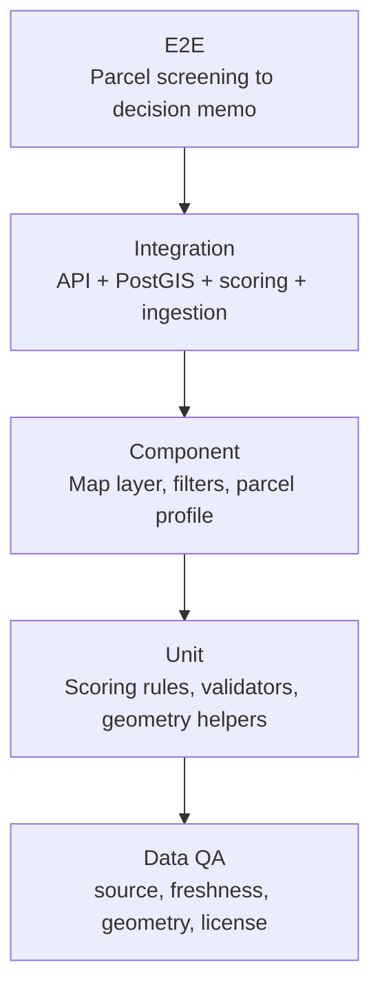
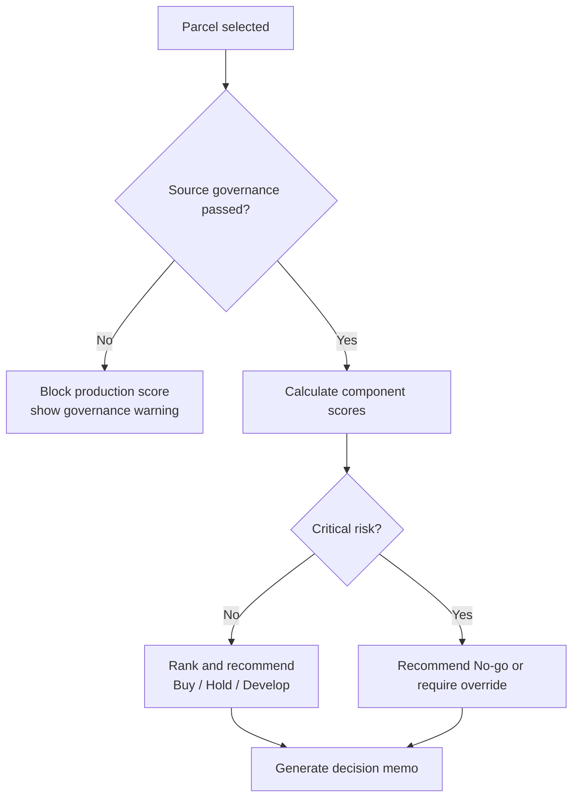

# 🧪 Testing & Evaluation Strategy

เอกสารนี้กำหนด QA strategy, evaluation rubric, acceptance criteria และ test matrix สำหรับ Strategic Land Intelligence Platform โดยครอบคลุม GIS, data pipeline, scoring, UI workflow และ governance

> หมายเหตุ: ยังไม่มี implementation จริงให้ตรวจ endpoint หรือ component behavior ดังนั้น test cases ด้านล่างเป็น acceptance-level baseline สำหรับใช้กำกับการพัฒนา MVP

## 🎯 QA Goals

- ยืนยันว่าแผนที่และข้อมูล spatial แสดงถูกต้องตาม source และ geometry
- ยืนยันว่า score model คำนวณตาม weight ที่กำหนดและอธิบายได้
- ป้องกันการใช้ข้อมูล external ที่ไม่มี license หรือ stale ใน decision workflow
- ครอบคลุม business-critical path ตั้งแต่ parcel screening ถึง decision memo
- ทำ regression test ให้ score, map layer และ data ingestion ไม่เปลี่ยนโดยไม่ตั้งใจ

## 🧭 Test Pyramid

## ✅ Acceptance Criteria

| Area | Criteria |
|---|---|
| Parcel Search | ผู้ใช้ค้นหา/เลือก parcel ได้ และระบบแสดง geometry, area, source, freshness |
| Layer Overlay | เปิด/ปิด layer ได้โดยไม่ทำให้ map state เสีย และ layer สำคัญมี legend/source |
| Zoning Evidence | parcel profile แสดง zoning intersection, FAR/OSR/buildability fields และ source date |
| Score Calculation | total score = ผลรวม weighted component และ weights รวม 100 |
| Recommendation | recommendation ต้องมี threshold, evidence, confidence และ model version |
| Governance | source ที่ license status ไม่ผ่านต้องไม่ถูกใช้ใน production scoring |
| Audit Trail | ทุก score run ต้องเก็บ input layer version, timestamp, user และ override reason ถ้ามี |
| Decision Memo | export ต้องมี score, component evidence, assumptions, source freshness และ risk notes |

## 🧮 Evaluation Rubric

| Dimension | Weight | Pass Standard |
|---|---:|---|
| GIS Accuracy | 20 | geometry valid, overlay ถูกต้อง, distance/proximity error อยู่ใน tolerance |
| Data Quality | 20 | freshness, completeness, duplicate, source lineage ผ่าน threshold |
| Scoring Correctness | 20 | component score, weighted score และ recommendation ตรง policy |
| Product Usability | 15 | core workflow ใช้ได้โดยไม่ต้องพึ่ง manual spreadsheet |
| Governance & Compliance | 15 | license, attribution, RBAC และ audit trail ครบ |
| Performance & Reliability | 10 | spatial query/map interaction อยู่ใน SLA MVP |

## 🧾 Score Model Validation

| Category | Weight | Validation |
|---|---:|---|
| Location & Accessibility | 25 | ทดสอบ proximity, station status, road access และ boundary cases |
| Planning & Buildability | 20 | ทดสอบ zoning intersection, FAR/OSR mapping และ multi-zone parcel |
| Market Demand | 20 | ทดสอบ demand aggregation ตาม catchment และ missing data handling |
| Competitive Position | 15 | ทดสอบ competitor radius, duplicate competitor และ price outlier |
| Land Cost & Feasibility | 10 | ทดสอบ price normalization, area unit conversion และ assumption override |
| Risk & Constraint | 10 | ทดสอบ risk overlap, severity mapping และ no-go override |

## 🧪 Test Matrix

| Test Type | Scope | Example Cases | Owner |
|---|---|---|---|
| Unit | scoring functions | weights sum to 100, risk penalty, threshold mapping | Engineering |
| Unit | geometry utilities | invalid polygon, CRS transform, area calculation | Engineering/Data |
| Integration | PostGIS query | parcel intersects zoning, nearest station, POI count radius | Engineering/Data |
| Integration | ingestion | schema validation, duplicate detection, failed license gate | Data |
| Component | map UI | layer toggle, selected parcel highlight, legend/source display | Frontend QA |
| E2E | decision workflow | search parcel -> view score -> export memo | QA/Product |
| Regression | score stability | same inputs produce same score for same model version | QA/Data |
| Security | RBAC | confidential land bank fields hidden from viewer role | Security/QA |
| Governance | source use | unapproved Google Places/market portal source blocked from scoring | Data Governance |
| Performance | GIS | p95 spatial query and map interaction within MVP SLA | Engineering |

## 🔍 Data QA Checklist

- Geometry: `ST_IsValid`, non-empty, expected SRID, within Thailand/admin boundary
- Completeness: required fields present for scoring features
- Freshness: source updated within agreed cadence
- Lineage: `source_id`, `ingestion_run_id`, `observed_at`, `published_at`
- Licensing: approved usage before production scoring or memo export
- Confidence: low-confidence source must reduce confidence or trigger warning
- Reconciliation: manual override requires reason, owner and timestamp

## 🧑‍⚖️ Decision Acceptance Scenarios

## 📋 MVP Test Cases

| ID | Scenario | Expected Result |
|---|---|---|
| QA-001 | เลือกแปลงที่มี geometry ถูกต้อง | parcel profile แสดง area, source, freshness และ map highlight |
| QA-002 | เปิด zoning layer ทับ parcel | แสดง zoning code/FAR/OSR ที่ intersect พร้อม source date |
| QA-003 | แปลงอยู่ใกล้ mass transit | Location score สะท้อน proximity ตาม policy |
| QA-004 | source license ไม่ approved | layer/scoring ถูก block หรือแสดง warning ตาม governance rule |
| QA-005 | score component รวมกัน | total score เท่ากับผลรวม weighted score และ weights รวม 100 |
| QA-006 | พบ flood/high legal risk | Risk score ลดลงและ recommendation อธิบาย constraint |
| QA-007 | export decision memo | memo มี score, evidence, assumptions, model version และ source freshness |
| QA-008 | role viewer เปิด land bank confidential field | ระบบซ่อนข้อมูล owner/contact/deal notes |
| QA-009 | ingestion geometry invalid | record เข้า quarantine และไม่ publish เข้า core layer |
| QA-010 | rerun score ด้วย model version เดิม | ผลลัพธ์ต้อง deterministic เมื่อ input ไม่เปลี่ยน |

## 🚦 Release Gates

| Gate | Required Evidence |
|---|---|
| Alpha | map loads, parcel profile works, core source registry exists |
| Beta | zoning/transport/land bank layers validated, score draft tested |
| Pilot | AP user validates shortlist workflow, governance warnings visible |
| Production MVP | audit trail, RBAC, data freshness, regression tests and decision memo pass |

